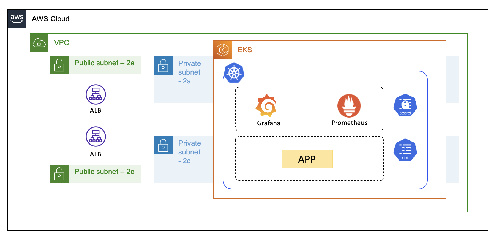

> ## Kubernetes Cluster Resource Monitoring(Prometheus & Grafana)

> ### About.
- Cluster 내부의 자원에대한 모니터링 및 Slack 알림 발송을 위한 모델을 구축합니다.
---

> ## 전체 구조


> ### 사용 기술
- Kubernetes
    + Namespace: Application(kube-example), Prometheus(Monitoring), Grafana(Monitoring)
    + Deployment: Application, Prometheus, Grafana
    + ConfingMap: Prometheus, Grafana
    + Secret: Grafana(Auth)
    + DaemonSet: Prometheus(Node Export)
    + Helm: AWS Ingress Controller

- AWS(Terraform)
    + VPC(Module)
    + EKS(Module)
    + IAM: ALB Ingress Policy Attachment(Node Group)

> ### How to Use?
```
# 1. Terraform으로 AWS Infra 배포
# cd ./stage
$ terraform apply --auto-approve

# 2. EKS Cluster Config File등록
$ aws eks region <region> update-kubeconfig --name <cluster name>

# 3. AWS Ingress Controller 배포(Helm repository: AWS)
$ helm repo add eks https://aws.github.io/eks-charts
$ helm install aws-load-balancer-controller eks/aws-load-balancer-controller -n kube-system --set clusterName=<cluster_name>

# 4. Application, Grafana ALB 배포
$ kubectl apply -f stage/k8s/application.yaml,stage/k8s/grafana_ingress.yaml

# 5. ALB Address CNAME등록
$ kubectl describe ing -n kube-example | grep Address
$ kubectl describe ing -n monitoring | grep Address

# 6. Prometheus, Grafana 배포
$ kubectl apply -f stage/k8s/prometheus.yaml,stage/k8s/grafana_secret.yaml,stage/k8s/grafana.yaml
```

> ### Grafana Evironment Setting

1. grafana.ini 파일에서 섹션을 선택합니다.
    ```
    #################################### Server ##############################
    [server]
    # Protocol (http, https, h2, socket)
    protocol = http

    # The ip address to bind to, empty will bind to all interfaces
    http_addr =

    # The http port to use
    http_port = 3000

    # The public facing domain name used to access grafana from a browser
    domain = localhost
    ```

2. 환경변수 지정방법(Secret 사용)
    ```sh
    # Shell
    # export GF_<SectionName>_<KeyName>

    GF_SERVER_HTTP_PORT = "3000"
    ```
    ```yaml
    # Grafana Deployment
    apiVersion: apps/v1
    kind: Deployment
    metadata:
    name: grafana
    namespace: monitoring
    spec:
    replicas: 1
    selector:
        matchLabels:
        app: grafana
    template:
        metadata:
        name: grafana
        labels:
            app: grafana
        spec:
        volumes:
        - name: grafana-config-volume # ConfigMap
            configMap:
            name: grafana-config
            items:
            - key: datasource.yaml
                path: provisioning/datasources/datasource.yaml
            - key: dashboard.json
                path: dashboard.json
        containers:
        - name: grafana
            image: grafana/grafana
            ports:
            - name: grafana
            containerPort: 3000
            env:
            - name: GF_SECURITY_ADMIN_USER
            valueFrom: 
                secretKeyRef:
                name: grafana-secret
                key: username
            - name: GF_SECURITY_ADMIN_PASSWORD
            valueFrom: 
                secretKeyRef:
                name: grafana-secret
                key: password
            - name: GF_DASHBOARDS_DEFAULT_HOME_DASHBOARD_PATH # 지정 Dashboard 사용
            value: /app/data/dashboard.json
            - name: GF_PATHS_PROVISIONING # 지정 Datasource(Prometheus) 사용
            value: /app/data/provisioning
    ```

> ### 시행착오

- EFS를 PV로 마운트하여 Grafana Config(Dashboard, Datasource) 사용(ConfigMap의 이해부족) - stage/k8s/pv.yaml
    + Job 사용: Grafana의 Datasource Import를 위해 curl 이미지를 사용한 http post job을 사용하려 했으나 실패 - stage/k8s/grafana.yaml 주석
    + S3 사용: PV지원 중 S3항목은 없지만 별도의 Job을 사용하여 S3에 PUSH 및 PULL을 시도하려했으나 실패 - stage/node_group_s3.tf(node의 s3권한 설정)

- Prometheus를 EC2에 설치하여 매트릭 수집
    + Prometheus를 가용성을 위해 각 가용영역에 1대씩 배치하고 LoadBalancer를 이용하려했으나 비용 최적화 문제로 EKS에 Deployment
    + Prometheus Installation(On-Demand)
    ```
    # 설치
    wget https://github.com/prometheus/prometheus/releases/download/v2.31.1/prometheus-2.31.1.linux-amd64.tar.gz
    tar -xvzf prometheus-2.31.1.linux-amd64.tar.gz
    sudo mv prometheus-2.31.1.linux-amd64 ../prometheus

    # 관리계정
    sudo groupadd -r prometheus
    sudo useradd -r -g prometheus -s /sbin/nologin -d /home/prometheus/ -c "prometheus Daemons" prometheus
    sudo chown -R prometheus:prometheus -R /home/prometheus

    # Target 설정
    sudo vim /home/prometheus/prometheus.yml # Line 29

    # 실행 설정
    sudo vim /etc/systemd/system/prometheus.service

    # Daemon에 등록
    [Unit]
    Description=Prometheus Server
    Documentation=https://prometheus.io/docs/introduction/overview/
    After=network-online.target

    [Service]
    User=prometheus
    Group=prometheus
    Restart=on-failure

    #Change this line if you download ther 
    #Prometheus on different path user
    ExecStart=/home/prometheus/prometheus \
        --config.file=/home/prometheus/prometheus.yml \
        --storage.tsdb.path=/data/prometheus \
        --web.console.templates=/home/prometheus/consoles \
        --web.console.libraries=/home/prometheus/console_libraries \
        --web.listen-address=0.0.0.0:9090 \
        --web.enable-admin-api 

    [Install]
    WantedBy=multi-user.target
    ```