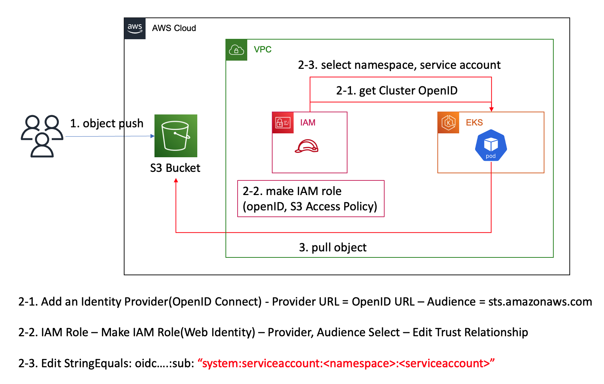

> ## Kubernetes Cluster Resource Monitoring(Prometheus & Grafana)

- About.
    + Cluster 내부의 자원에대한 모니터링 및 Slack 알림 발송을 위한 모델을 구축합니다.
---

> ## 전체 구조


> ### 사용 기술
- Kubernetes
    + Namespace: Application(kube-example), Prometheus(Monitoring), Grafana(Monitoring)
    + Deployment: Application, Prometheus, Grafana
    + ConfingMap: Prometheus, Grafana
    + Secret: Grafana(Auth)
    + DaemonSet: Prometheus(Node Export)
    + Helm: AWS Ingress Controller

- AWS(Terraform)
    + VPC(Module)
    + EKS(Module)
    + IAM: ALB Ingress Policy Attachment(Node Group)

> ### How to Use?
```
# 1. Terraform으로 AWS Infra 배포
# cd ./stage
$ terraform apply --auto-approve

# 2. EKS Cluster Config File등록
$ aws eks region <region> update-kubeconfig --name <cluster name>

# 3. AWS Ingress Controller 배포(Helm repository: AWS)
$ helm repo add eks https://aws.github.io/eks-charts
$ helm install aws-load-balancer-controller eks/aws-load-balancer-controller -n kube-system --set clusterName=<cluster_name>

# 4. Application, Grafana ALB 배포
$ kubectl apply -f stage/k8s/application.yaml,stage/k8s/grafana_ingress.yaml

# 5. ALB Address CNAME등록
$ kubectl describe ing -n kube-example | grep Address
$ kubectl describe ing -n monitoring | grep Address

# 6. Grafana Secret 배포(web console id, password)
# $ kubectl apply -f stage/k8s/grafana_secret.yaml

# 7. Prometheus, Grafana 배포
$ kubectl apply -f stage/k8s/prometheus.yaml,stage/k8s/grafana.yaml
```

> ### Prometheus Setting

- Deployment: Prometheus, Alertmanager, Kube-State-Metrics

1. Prometheus 및 Kube-State-Metrics가 Kubernetes API서버에 접근할 권한을 가지고 Metrics을 Collect
    - Cluster Role, Service Account 및 Cluster Role Bind 설정
    - prometheus.yml에서 메트릭, 수집주기, 수집형태를 정의하고 ConfigMap으로 저장 (AWS EC2의 Node는 별도 보안 구성을 해야 확인이 가능)
    - ClusterIP 및 NodePort로 Service 생성

2. Alertmanger 설정
    - prometheus.rules파일에는 Alertmanager로 보낼 Alert 규칙 설정하고 ConifgMap으로 저장
    - alertset.yml에 Slack으로 전달할 메시지 커스터마이징과 Alert 규칙 설정
    - prometheus에 Alertmanager를 target으로 지정
    - NodePort로 Service 생성

3. Deployment
    - Proemtheus Pod
        - Prometheus Container
        - Alertmanager Container
    - Kube State Metrics Pod
        - kube-state-metrics Container

> ### Grafana Setting

1. DashBoard Custom
    - DataSource에 Prometheus 추가
    - Dashboard 구성
    - Dashboard json파일을 export
    - Dashboard.json으로 ConfigMap 작성

2. DataSource Provision
    - datasource.yml으로 ConfigMap 작성
        + url은 prometheus NodePort로 지정(http://prometheus-service:8080)
    ++ DataSource는 Web API로 확인 가능(https://grafana.eocis.com/api/datasources)

3. Grafana 환경변수 설정  
    1.  grafana.ini 파일에서 섹션을 확인
        ```
        #################################### Server ##############################
        [server]
        # Protocol (http, https, h2, socket)
        protocol = http

        # The ip address to bind to, empty will bind to all interfaces
        http_addr =

        # The http port to use
        http_port = 3000

        # The public facing domain name used to access grafana from a browser
        domain = localhost
        ```  
    2. 환경변수 지정방법(Secret 사용)
        ```sh
        # Shell
        # export GF_<SectionName>_<KeyName>

        GF_SERVER_HTTP_PORT = "3000"
        ```
        ```yaml
        # Grafana Deployment
        apiVersion: apps/v1
        kind: Deployment
        metadata:
        name: grafana
        namespace: monitoring
        spec:
        replicas: 1
        selector:
            matchLabels:
            app: grafana
        template:
            metadata:
            name: grafana
            labels:
                app: grafana
            spec:
            volumes:
            - name: grafana-config-volume # ConfigMap
                configMap:
                name: grafana-config
                items:
                - key: datasource.yaml
                    path: provisioning/datasources/datasource.yaml
                - key: dashboard.json
                    path: dashboard.json
            containers:
            - name: grafana
                image: grafana/grafana
                ports:
                - name: grafana
                containerPort: 3000
                env:
                - name: GF_SECURITY_ADMIN_USER
                valueFrom: 
                    secretKeyRef:
                    name: grafana-secret
                    key: username
                - name: GF_SECURITY_ADMIN_PASSWORD
                valueFrom: 
                    secretKeyRef:
                    name: grafana-secret
                    key: password
                - name: GF_DASHBOARDS_DEFAULT_HOME_DASHBOARD_PATH # 지정 Dashboard 사용
                value: /app/data/dashboard.json
                - name: GF_PATHS_PROVISIONING # 지정 Datasource(Prometheus) 사용
                value: /app/data/provisioning
        ```

4. Deployment
    - Grafana Pod
        - Grafana Container

> ### 시행착오

- EFS를 PV로 마운트하여 Grafana Config(Dashboard, Datasource) 사용(ConfigMap의 이해부족) - stage/k8s/pv.yaml
    + Job 사용: Grafana의 Datasource Import를 위해 curl 이미지를 사용한 http post job을 사용하려 했으나 실패 - stage/k8s/grafana.yaml 주석
    + S3 사용: PV지원 중 S3항목은 없지만 별도의 Job을 사용하여 S3에 PUSH 및 PULL을 시도하려했으나 실패 - stage/node_group_s3.tf(node의 s3권한 설정)

- Slack Alert을 Prometheus가 아닌 Grafana에서 설정하려 시도
    + Grafana의 경우 Dashboard 및 DataSource(Proemtheus와의 연결)는 프로비전이 가능했으나 Alert 까지는 프로비전이 힘들며 구성하려해도 비효율적
        + Alert은 Web Console에서 설정 또는 API 요청으로 생성해야하기에 수작업 또는 curl container를 배포해야하는 단점이 존재

- Prometheus를 EC2에 설치하여 매트릭 수집
    + Prometheus를 가용성을 위해 각 가용영역에 1대씩 배치하고 LoadBalancer를 이용하려했으나 비용 최적화 문제로 EKS에 Deployment
    + Prometheus Installation(On-Demand)
        ```
        # 설치
        wget https://github.com/prometheus/prometheus/releases/download/v2.31.1/prometheus-2.31.1.linux-amd64.tar.gz
        tar -xvzf prometheus-2.31.1.linux-amd64.tar.gz
        sudo mv prometheus-2.31.1.linux-amd64 ../prometheus

        # 관리계정
        sudo groupadd -r prometheus
        sudo useradd -r -g prometheus -s /sbin/nologin -d /home/prometheus/ -c "prometheus Daemons" prometheus
        sudo chown -R prometheus:prometheus -R /home/prometheus

        # Target 설정
        sudo vim /home/prometheus/prometheus.yml # Line 29

        # 실행 설정
        sudo vim /etc/systemd/system/prometheus.service

        # Daemon에 등록
        [Unit]
        Description=Prometheus Server
        Documentation=https://prometheus.io/docs/introduction/overview/
        After=network-online.target

        [Service]
        User=prometheus
        Group=prometheus
        Restart=on-failure

        #Change this line if you download ther 
        #Prometheus on different path user
        ExecStart=/home/prometheus/prometheus \
            --config.file=/home/prometheus/prometheus.yml \
            --storage.tsdb.path=/data/prometheus \
            --web.console.templates=/home/prometheus/consoles \
            --web.console.libraries=/home/prometheus/console_libraries \
            --web.listen-address=0.0.0.0:9090 \
            --web.enable-admin-api 

        [Install]
        WantedBy=multi-user.target
        ```

> ### 추가 참고사항
- Kubernetes Container use S3: 별도의 AWS Configure 설정없이 S3에 접근 가능한 방법입니다.


```yaml
# 확인
apiVersion: v1
kind: Pod
metadata:
  name: s3-test
  namespace: <namespace>
spec:
  serviceAccountName: <serviceaccount>
  Containers:
  - image: amazon/aws-cli
    name: my-aws-cli
    command: ['aws', 's3', 'ls', 's3://cluster-s3/']
status: {}
```

- Prometheus ConfigMap에서 접근권한을 TLS로 활성화해야 정상적으로 Metrics을 수집합니다.
    ```yaml
    tls_config: # TLS 서비스를 사용
        ca_file: /var/run/secrets/kubernetes.io/serviceaccount/ca.crt # Kubernetes Certification 지정
    bearer_token_file: /var/run/secrets/kubernetes.io/serviceaccount/token
    ```

- Prometheus는 현재까지 Timestamp 변경을 지원하지 않습니다.  
    https://github.com/prometheus/prometheus/issues/500
---

<참고>
Prometheus Config: https://prometheus.io/docs/prometheus/latest/configuration/configuration
CloudWatch - Prometheus: https://docs.aws.amazon.com/ko_kr/AmazonCloudWatch/latest/monitoring/ContainerInsights-Prometheus-Setup-configure.html